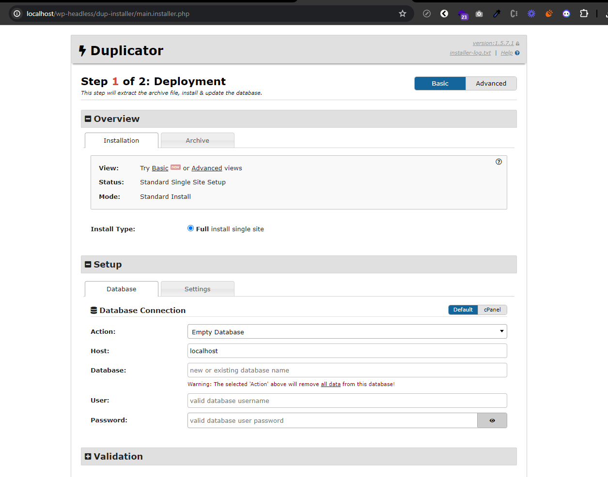
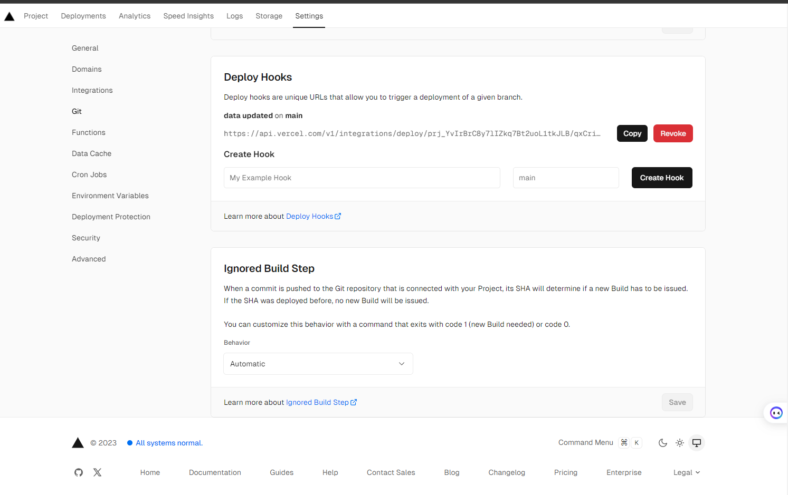
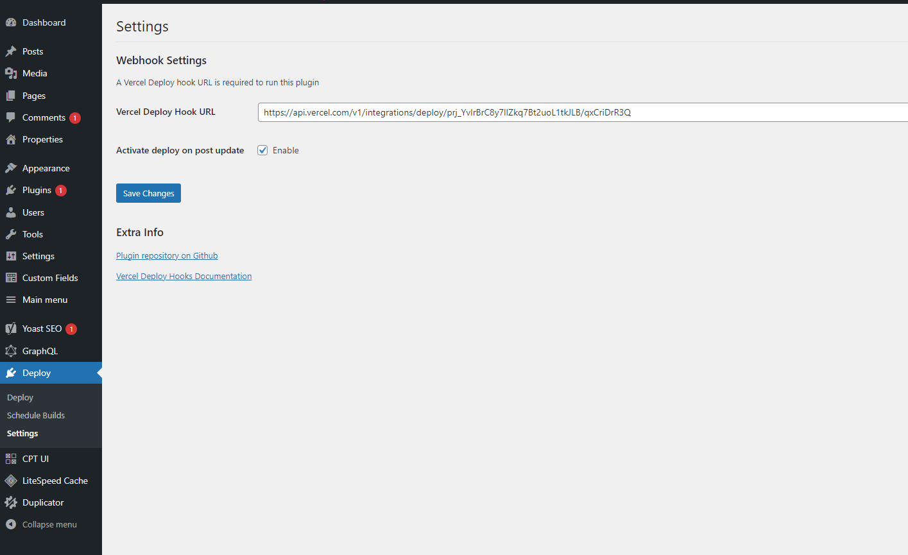

# Wordpress Headless + Nextjs
## Setup Wordpress tại localhost
Khi bạn dùng xamp, ta tạo một folder `wp-headless` nằm trong thư mục `htdocs`. Copy wordpress duplicator vào folder này.

### Chạy Installer
Chạy installer bằng đường dẫn

```
http://localhost/wp-headless/installer.php
```


Điền thông tin database vào và chạy.

### Admin Wordpress
```
username: admin-wp-headless
email: adminwp@gmail.com
password: password123
```

## Setup NextJS
Install package
```
npm install
```

Thêm file `.env`
```
WP_GRAPHQL_URL=http://localhost/wp-headless/graphql  
WP_IMAGES_URL=http://localhost/wp-headless
  
NEXT_PUBLIC_WORDPRESS_URL=http://localhost/wp-headless  
NEXT_PUBLIC_FRONTEND_URL=http://localhost:3000  
NEXT_PUBLIC_ITEM_PER_SITEMAP=50
```

## Deploy
- Setup Wordpress trên hosting
- Setup NextJS trên Vercel
    - Domain
    - Tạo Deploy hooks & lưu trong Wordpress





### Plugins backup
https://drive.google.com/file/d/1CCQxxaV7EA01r4hYKDKQvM4y5LnbflVt/view?usp=drive_link
